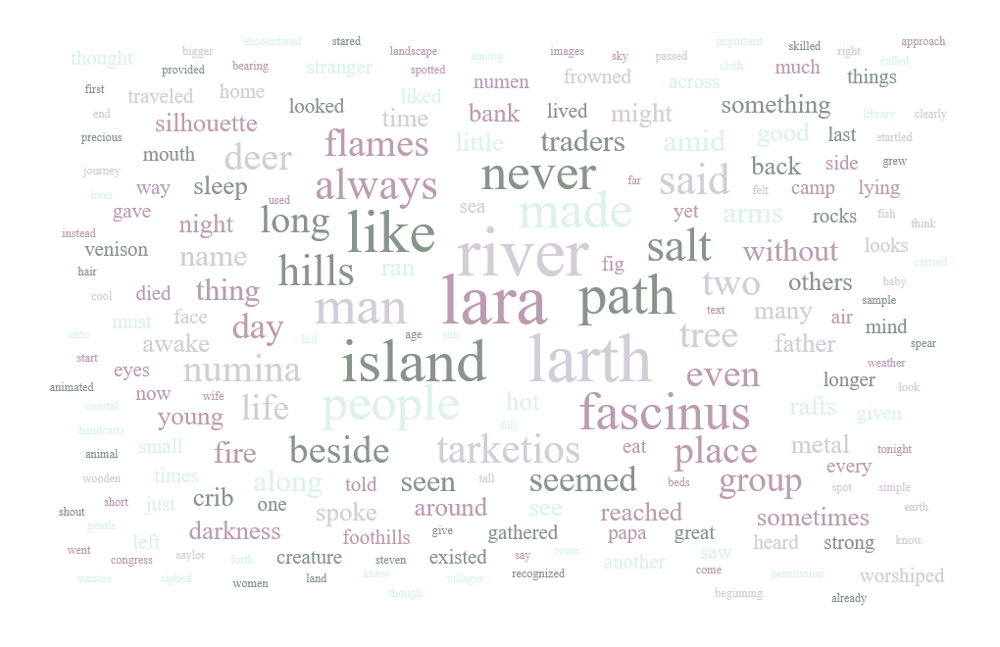
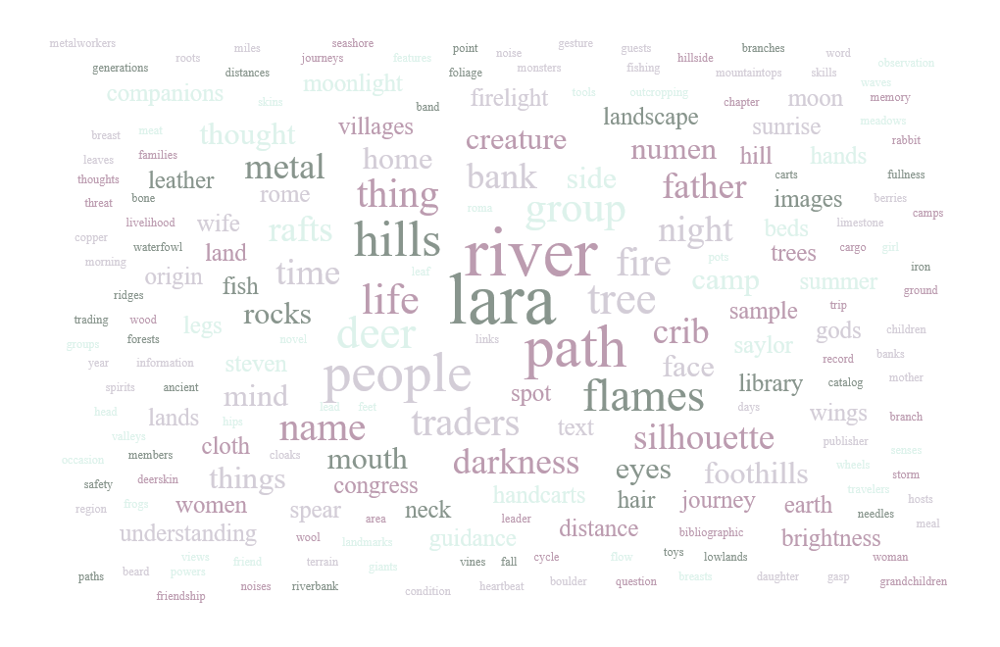
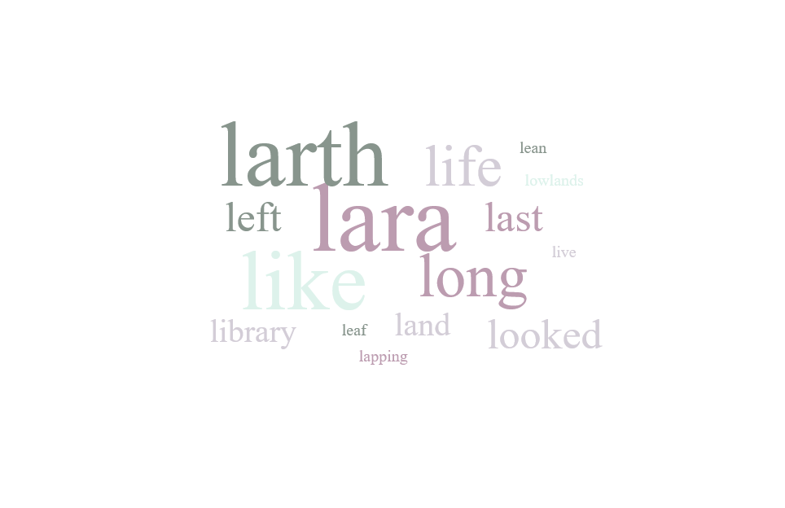

# 🌟 AI-Powered Word Cloud Generator

> Transform any webpage into beautiful, intelligent word clouds with AI-driven filtering

A Chrome extension that analyzes webpage content and generates dynamic word clouds with optional **AI-powered filtering** using OpenAI's GPT-4o-mini. Perfect for content analysis, research, and visual text exploration.

[](https://github.com)
[](https://openai.com)
[](https://d3js.org)

> **⚠️ Proof of Concept**: This extension is currently a proof of concept and demonstration project. Features like API key storage and user customization are not fully implemented for production use.

---

## ✨ Key Features

### 🎨 **Beautiful Visualization**
- Dynamic word clouds using **D3.js** and **d3-cloud**
- Logarithmic font scaling based on word frequency
- Adaptive canvas sizing (500px-800px) based on word count

### 🤖 **AI-Powered Filtering** *(Optional)*
- Filter words by **semantic meaning** using OpenAI GPT-4o-mini
- Example prompts: "only nouns", "words starting with L", "food-related terms"
- Processes up to 1000 unique words per request for comprehensive analysis
- Cost-effective: ~$0.0015 per word cloud (~4000 tokens total)
- User brings their own API key (free $5 credit for new OpenAI accounts = ~3,300 clouds)

### ⚙️ **Customizable Settings**
- Adjustable word limit slider (1-2000 words, capped at 200 with AI filter)
- Minimum word length: 3 characters
- Smart stop-word filtering
- Persistent settings via Chrome storage

### 📊 **Smart Analysis**
- Real-time word frequency counting
- Total word statistics display
- Dynamic viewport scaling for smaller screens
- Input sanitization and validation

---

## 🎯 AI Filtering in Action

See the power of AI-driven semantic filtering:

### Standard Word Cloud (No Filter)

*All words from the page analyzed by frequency*

### AI Filtered: "only nouns"

*Intelligent extraction of noun-based concepts*

### AI Filtered: "words starting with L"

*Precise pattern-based filtering*

> **Note:** AI filtering uses your OpenAI API key. New users get $5 free credit (~3,300 word clouds).

---

## 🚀 Quick Start

### Installation

#### Chrome / Edge / Brave

1. **Clone or download** this repository
2. Open your browser and navigate to:
   - **Chrome**: `chrome://extensions/`
   - **Edge**: `edge://extensions/`
   - **Brave**: `brave://extensions/`
3. Enable **"Developer mode"** (toggle in top right)
4. Click **"Load unpacked"**
5. Select the `wordsearch_extension` folder
6. Pin the extension icon for easy access

#### Firefox

1. **Clone or download** this repository
2. Open Firefox and navigate to `about:debugging#/runtime/this-firefox`
3. Click **"Load Temporary Add-on..."**
4. Navigate to the extension folder and select the `manifest.json` file
5. The extension will be loaded (note: temporary installations are removed when Firefox closes)

### Basic Usage

1. Navigate to any webpage
2. Click the extension icon in your toolbar
3. *(Optional)* Toggle **AI Filter** in settings and add your OpenAI API key
4. *(Optional)* Enter a filter prompt (e.g., "only emotions", "technology words")
5. Click **"Generate Word Cloud"**
6. View your visualization!

### AI Filter Setup (Optional)

1. Click the **settings** icon (⋮)
2. Toggle **"AI Filter"** on
3. Enter your **OpenAI API key** ([Get one here](https://platform.openai.com/api-keys))
4. Enter a filtering prompt in the main screen
5. Generate your filtered word cloud

> **⚠️ Important**: Your API key is **not permanently stored**. It is only kept in browser memory during your current session and will be **lost when you close the browser**. You will need to re-enter your API key each time you restart your browser.

---

## 🔧 Build Instructions

### Development Setup

This extension uses **vanilla JavaScript** with no build process required. All files are ready to use directly.

**Prerequisites:**
- A Chromium-based browser (Chrome, Edge, Brave) or Firefox
- Text editor (VS Code, Sublime, etc.)
- *(Optional)* OpenAI API key for AI filtering features

**Steps:**

1. **Clone the repository**
   ```bash
   git clone <repository-url>
   cd wordsearch_extension
   ```

2. **Verify file structure**
   ```
   wordsearch_extension/
   ├── manifest.json
   ├── popup.html
   ├── popup.js
   ├── content.js
   ├── styles.css
   ├── d3.v7.min.js
   ├── d3.layout.cloud.min.js
   └── icons/
       ├── icon_small.png
       └── icon_large.png
   ```

3. **Load as unpacked extension** (see [Installation](#installation) section above)

4. **Make changes and test**
   - Edit any file in your text editor
   - Return to `chrome://extensions/` and click the **refresh icon** on the extension card
   - Test your changes by clicking the extension icon


---

## 🛠️ Technical Architecture

### Tech Stack

| Category | Technologies |
|----------|-------------|
| **Frontend** | HTML5, CSS3, Vanilla JavaScript (ES6+) |
| **Visualization** | D3.js v7, d3-cloud layout algorithm |
| **AI Integration** | OpenAI GPT-4o-mini API |
| **Browser APIs** | Chrome Extension API (Manifest V3) |
| **Storage** | Chrome Storage API (persistent settings) |
| **Security** | Input sanitization, API key validation, secure storage |

### Project Structure

```
wordsearch_extension/
├── manifest.json          # Extension configuration (Manifest V3)
├── popup.html            # Main UI structure
├── popup.js              # Core logic (~800 lines)
├── content.js            # DOM text extraction
├── styles.css            # Responsive styling
├── d3.v7.min.js          # D3.js library
├── d3.layout.cloud.min.js # Word cloud layout
├── icons/                # Extension icons
│   ├── icon_small.png
│   └── icon_large.png
└── README.md
```

### Key Implementation Details

#### **1. Text Extraction & Processing**
```javascript
// content.js - DOM traversal
const text = document.body.innerText;

// popup.js - Processing pipeline
text
  .toLowerCase()
  .replace(/[^a-z0-9\s]/g, ' ')    // Remove punctuation
  .split(/\s+/)
  .filter(word => word.length >= 3)  // Min length
  .filter(word => !STOP_WORDS.has(word)); // Stop word filter
```

#### **2. AI-Powered Filtering**
```javascript
// OpenAI API integration
const response = await fetch('https://api.openai.com/v1/chat/completions', {
  method: 'POST',
  headers: {
    'Authorization': `Bearer ${apiKey}`,
    'Content-Type': 'application/json'
  },
  body: JSON.stringify({
    model: 'gpt-4o-mini',
    messages: [...],
    temperature: 0.3,
    max_tokens: 500
  })
});
```

#### **3. Dynamic Rendering**
- Virtual canvas technique: 5x target size for optimal word placement
- Logarithmic font scaling: `d3.scaleLog().domain([minFreq, maxFreq]).range([10, 60])`
- Responsive viewport: 500×350px (min) to 800×550px (max)
- Screen size detection: Auto-scales for smaller displays

#### **4. State Management**
- Chrome Storage API for persistent settings
- Event-driven UI updates
- Async/await for API calls
- Error boundary handling with user-friendly messages

### Security & Validation

- **Input Sanitization**: Removes control characters (`\x00-\x1F`) from user input
- **API Key Validation**: Pre-validates against OpenAI's `/models` endpoint
- **Secure Storage**: API keys stored locally via Chrome Storage (encrypted by browser)
- **Character Limits**: 250-char prompt limit, paste truncation
- **Error Handling**: Graceful degradation with specific error messages

## 📈 Performance & Optimization

- **Fast Rendering**: Virtual canvas technique allows D3 to process 2000+ words efficiently
- **Smart Filtering**: Stop-word list reduces noise
- **Responsive Design**: Adapts to screen sizes from 300px to 800px width
- **API Efficiency**: Processes up to 1000 unique words per AI request (~4000 tokens total)

---

## 🚧 Future Plans

This project is currently a proof of concept. Planned enhancements include:

### **User Management & Security**
- **Database Integration**: Set up a secure backend database to store user accounts and API keys
- **Encrypted Key Storage**: Implement secure, encrypted storage for OpenAI API keys
- **User Authentication**: Add login/signup functionality to persist user settings across devices
- **Session Management**: Maintain user sessions to avoid re-entering credentials

### **Customization Features**
- **Theme System**: Multiple color themes and presets (dark mode, light mode, custom palettes)
- **Custom Color Schemes**: User-defined color gradients for word clouds
- **Font Customization**: Choose from different font families and styles
- **Layout Options**: Different word cloud layouts and shapes
- **Export Options**: Save word clouds as PNG, SVG, or PDF files

### **Enhanced Features**
- **Word Cloud History**: Save and revisit previously generated word clouds
- **Sharing Capabilities**: Share word clouds via URL or social media
- **Advanced AI Filters**: More sophisticated filtering options and presets
- **Multi-language Support**: Better handling of non-English text

Contributions and suggestions are welcome! Feel free to open an issue or submit a pull request.

---

## 📄 License

MIT License - Free to use and modify for personal or commercial projects.

---

## 🔗 Resources

**Libraries & APIs:**
- [D3.js](https://d3js.org/) - Data visualization library
- [d3-cloud](https://github.com/jasondavies/d3-cloud) - Word cloud layout algorithm
- [OpenAI API](https://platform.openai.com/docs/api-reference) - GPT-4o-mini integration
- [Montserrat Font](https://fonts.google.com/specimen/Montserrat) - Google Fonts

**Documentation:**
- [Chrome Extensions Manifest V3](https://developer.chrome.com/docs/extensions/mv3/)
- [Chrome Storage API](https://developer.chrome.com/docs/extensions/reference/storage/)

---

<div align="center">

</div>
